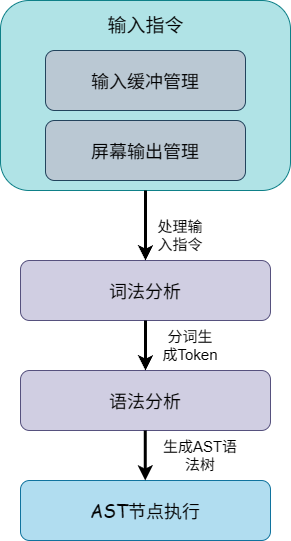

# SHELL 挑战性任务

## 任务要求

本任务需要你基于MOS LAB6中的Shell进行增强，完成任务内容一节中的要求，**提交实现代码以及实现报告**并通过自动化评测，即可拿到该挑战性任务对应的分数。代码与报告提交通道将会在后续分别发布。

## 任务内容

### 支持相对路径

MOS 中现有的文件系统操作并不支持相对路径，对于一切路径都从根目录开始查找，因此在 shell 命令中也需要用绝对路径指代文件，这为命令的描述带来了不便。你需要为每个进程维护**工作目录**这一状态，实现相关内建指令，并为其他与路径相关的指令提供路径支持。

你可能需要了解以下术语:

*   **工作目录**：进程当前所在的目录，用于解析相对路径。
*   **绝对路径**：以 `/` 开头的路径，从根目录开始。
*   **相对路径**：不以 `/` 开头的路径，**相对于当前工作目录**解析,可能包含以下特殊符号。
*   **特殊符号**: `.`表示当前路径, `..`表示上一级路径

你需要实现以下功能:

#### 内建指令cd

| **输入**                | **行为**                                                             | **输出**                                                 | **返回值** |
| :---------------------- | :------------------------------------------------------------------- | :------------------------------------------------------- | :--------- |
| `cd`                    | 切换工作目录到 `/`                                                     | 无                                                       | 0          |
| `cd <abspath>`          | 若绝对路径 `<abspath>` 存在且为目录，切换到该目录                        | 无                                                       | 0          |
| `cd <relpath>`          | 根据当前工作路径，对相对路径`<relpath>`，若存在且为目录，切换到该目录 | 无                                                       | 0          |
| `cd <noexist_path>`     | 路径不存在                                                           | `cd: The directory '原始输入' does not exist\n`            | 1          |
| `cd <filepath>`         | 路径存在但不是目录                                                     | `cd: '原始输入' is not a directory\n`                      | 1          |
| `cd <arg1>..<argn>`     | 输入多于 1 个参数                                                      | `Too many args for cd command\n`                         | 1          |
| `cd .`                  | 解析为当前目录 `/dir1/dir2`，无变化                                    | 无                                                       | 0          |
| `cd ..`                 | 解析为 `/dir1`，若存在且为目录，切换到该目录                           | 无                                                       | 0          |

#### 内建指令pwd

| **输入**             | **行为**           | **输出**         | **返回值** |
| :------------------- | :----------------- | :--------------- | :--------- |
| `pwd`                | 输出当前工作目录     | `/dir1/dir2\n`   | 0          |
| `pwd arg1 ... argn`  | 参数数量错误       | `pwd: expected 0 arguments; got n\n` | 2          |

!!! 注意事项
    父进程能够将工作路径传递给子进程。

### 环境变量管理

MOS 中的Shell目前并不支持环境变量,你需要在shell中增加对环境变量的支持。

规定环境变量在命令中以`$`开头，名称与C语言变量命名要求，且长度不超过16，环境变量的值长度同样不超过16。环境变量可分为局部变量与非局部变量，仅非局部变量可传入子Shell中，并且只有非只读变量可被修改。

你需要实现以下内容:

1.  支持 内建指令`declare [-xr] [NAME [=VALUE]]` ，其中：
    *   `-x` 表示变量 `NAME` 为环境变量，否则为局部变量。
        *   环境变量对子 shell 可见，也就是说在 shell 中输入 `sh.b` 启动一个子 shell 后，可以读取并修改 `NAME` 的值，即支持环境变量的继承。
        *   局部变量对子 shell **不可见**，也就是说在 shell 中输入 `sh.b` 启动一个子 shell 后，没有该局部变量。
    *   `-r` 表示将变量 `NAME` 设为只读。只读变量不能被 `declare` 重新赋值或被 `unset` 删除。
    *   如果变量 `NAME` 不存在，需要创建该环境变量；如果变量 `NAME` 存在，将该变量赋值为 `VALUE`。
    *   其中 `VALUE` 为可选参数，缺省时将该变量赋值为空字符串即可。
    *   如果没有 `[-xr]` 及 `[NAME [=VALUE]]` 部分，即只输入 `declare`，则输出当前 shell 的所有变量，包括局部变量和环境变量。
2.  支持内建指令 `unset NAME` 命令，若变量 `NAME` 不是只读变量，则删除变量 `NAME`。
3.  支持在命令中展开变量的值，如使用 `echo.b $NAME` 打印变量 `NAME` 的值。

!!! 注意事项
    当执行`declare`指令时，需要以`<var>=<val>`(`<var>`为环境变量名,`<val>`为对应的值)输出当前Shell中的所有环境变量，评测不会对输出顺序进行测试。子Shell对环境变量的修改不会影响父Shell，且上述指令不能正确执行时返回非零值。

### 输入指令优化

#### 指令自由输入

现有的 shell 不支持在输入命令时移动光标。你需要实现：键入命令时，可以使用 <kbd>Left</kbd> 和 <kbd>Right</kbd> 移动光标位置，并可以在当前光标位置进行字符的增加与删除。要求每次在不同位置键入后，可以完整回显修改后的命令，并且键入回车后可以正常运行修改后的命令。

#### 不带 `.b` 后缀指令

你需要实现不带 `.b` 后缀的指令，但仍需兼容带有 `.b` 后缀的指令，如 `ls` 与 `ls.b` 都应能够正确列出当前目录下的文件。

#### 快捷键

你需要在Shell中实现以下快捷键:

| 快捷键        | 行为                                                                 |
| :------------ | :------------------------------------------------------------------- |
| left-arrow    | 光标尝试向左移动，如果可以移动则移动                                     |
| right-arrow   | 光标尝试向右移动，如果可以移动则移动                                     |
| backspace     | 删除光标左侧 1 个字符并将光标向左移动 1 列；若已在行首则无动作           |
| Ctrl-E        | 光标跳至最后                                                           |
| Ctrl-A        | 光标跳至最前                                                           |
| Ctrl-K        | 删除从当前光标处到最后的文本                                             |
| Ctrl-U        | 删除从最开始到光标前的文本                                               |
| Ctrl-W        | 向左删除最近一个 word：先越过空白(如果有)，再删除连续非空白字符           |

!!! 注意事项
    上述行为与Bash行为一致，如有模糊之处可直接参考Bash。

#### 历史指令

你需要实现 shell 中保存历史指令的功能，可以通过 <kbd>Up</kbd> 和 <kbd>Down</kbd> 选择所保存的指令并执行。你需要将历史指令保存到根目录的 `.mos_history` 文件中（一条指令一行），为了评测的方便，我们设定 `$HISTFILESIZE=20`（bash 中默认为 500），即在 `.mos_history` 中至多保存最近的 20 条指令。你还需要支持通过 `history` 命令输出 `.mos_history` 文件中的内容。

> 注：在 bash 中，`history` 为 shell built-in command，我们规定需要将 `history` 实现为 built-in command。

你需要将当前执行的指令先存入 `.mos_history` 中，例如：
```
echo `ls | cat`
echo meow # comment
history
history | cat
```

当历史指令为空时，依次执行上述四条指令后，后两条指令会分别输出
```
echo `ls | cat`
echo meow # comment
history
```
与
```
echo `ls | cat`
echo meow # comment
history
history | cat
```

使用 <kbd>Up</kbd> 能够切换到上一条指令（如果上一条指令存在），使用 <kbd>Down</kbd> 能够切换到下一条指令（如果下一条指令存在）。能够选择的指令范围为：用户当前输入的指令与 `.mos_history` 文件中保存的所有指令。例如在执行了上述四条指令后，用户输入了 `echo`，此时 <kbd>Up</kbd> 应该将指令切换至 `history | cat`，再次进行三次 <kbd>Up</kbd> 后切换至 ``echo  `ls | cat` ``，此时再次 <kbd>Up</kbd> 应保留在该指令（因为已经不存在上一条指令）；再进行四次 <kbd>Down</kbd> 后将切换回 `echo`，此时再次 <kbd>Down</kbd> 应保留在该指令（因为不存在下一条指令）。

!!! 注意事项
    历史指令输入时光标的处理参考Bash，当切换到新的指令时，光标会自动恢复到输入最末端。

#### 实现注释功能

你需要使用 `#` 实现注释功能，例如 `ls | cat # this is a comment meow`，`ls | cat` 会被正确执行，而后面的注释则会被抛弃。

#### 实现反引号

你需要使用反引号实现指令替换。你需要将反引号内指令执行的所有标准输出代替原有指令中的反引号内容。例如：
```
echo `ls | cat | cat | cat`
```

#### 实现一行多指令

你需要支持使用`;`将指令隔开，并按顺序执行，比如:
```
ls;ls;ls;ls
```

### 指令条件执行

你需要实现 Linux shell 中的 `&&` 与 `||`。
对于 `command1 && command2`，`command2` 被执行当且仅当 `command1` 返回 0；对于 `command1 || command2`，`command2` 被执行当且仅当 `command1` 返回非 0 值。

> 注: 评测中保证不出现括号。并且需要注意的是，在 bash 中 `&&` 与 `||` 的优先级相同，按照从左到右的顺序求值。
>
> 例如 `cmd1 || cmd2 && cmd3`，若 `cmd1` 返回 0，则 `cmd1` 执行后 `cmd2` 不会被执行，`cmd3` 会被执行；若 `cmd1` 返回非 0 且 `cmd2` 返回非 0，则 `cmd3` 将不会被执行。
>
> 提示：你可能需要修改 MOS 中对用户进程 `exit` 的实现，使其能够返回值。

### 更多指令

你需要实现 `touch`，`mkdir`，`rm` 指令以及内建指令`exit`，只需要考虑如下情形：

*   `touch`:
    *   `touch <file>`：创建空文件 `file`，若文件存在则放弃创建，正常退出无输出。
        若创建文件的父目录不存在则输出 `touch: cannot touch '<file>': No such file or directory`。
        例如 `touch nonexistent/dir/a.txt` 时应输出 `touch: cannot touch 'nonexistent/dir/a.txt': No such file or directory`。
*   `mkdir`:
    *   `mkdir <dir>`：若目录已存在则输出 `mkdir: cannot create directory '<dir>': File exists`，若创建目录的父目录不存在则输出 `mkdir: cannot create directory '<dir>': No such file or directory`，否则正常创建目录。
    *   `mkdir -p <dir>`：当使用 `-p` 选项时忽略错误，若目录已存在则直接退出，若创建目录的父目录不存在则递归创建目录。
*   `rm`:
    *   `rm <file>`：若文件存在则删除 `<file>`，否则输出 `rm: cannot remove '<file>': No such file or directory`。
    *   `rm <dir>`：命令行输出: `rm: cannot remove '<dir>': Is a directory`。
    *   `rm -r <dir>|<file>`：若文件或文件夹存在则删除，否则输出 `rm: cannot remove '<dir>|<file>': No such file or directory`。
    *   `rm -rf <dir>|<file>`：如果对应文件或文件夹存在则删除，否则直接退出。
*   （内建指令）`exit`:执行后退出当前shell

注:对于`rm`,`mkdir`,`touch`指令，若成功执行则返回0，否则返回非零值即可。

### 追加重定向

你需要实现 shell 中 `>>` 追加重定向的功能，例如：
```
ls >> file1
ls >> file1
```
最后文件 `file1` 中将会有两次 `ls` 指令的输出。

## 实现提示

​ Shell是一种命令解释器，对输入指令进行解析并执行。现有MOS实现的Shell实现的较为简陋，如果在其基础上尝试实现上述内容可能复杂度较高，可以参考sh,bash等工业界shell实现原理进行重新实现，以下是一个可行的实现方案:



其中:

1.  **输入指令层**
2.  **输入缓冲管理**：负责原始命令的读取，支持行编辑、历史记录等功能。
3.  **屏幕输出管理**：负责屏幕输出内容刷新。
4.  **词法分析**
5.  将读入的原始指令划分为最小语法单元Token，并识别特殊标识符(重定向，管道，注释，标识符等)
6.  **语法分析**
7.  根据Token序列构建语法树AST并识别命令结构
8.  **AST节点执行**
9.  遍历AST,根据节点类型在当前进程处执行并更新状态

语法分析可以使用递归下降法进行解析,EBNF文法如下:

```ebnf
# 指令输入
line        ::= list

# 列表
list        ::= and_or ( ( ";" ) and_or )*

# 逻辑与/或: 支持 && 和 ||
and_or      ::= pipeline ( ( "&&" | "||" ) pipeline )*

# 管道: 支持 |
pipeline    ::= command ( "|" command )*

# 简单命令：WORD 串 + 重定向
command     ::= WORD ( WORD | redirect )*

# 重定向
redirect    ::= "<" WORD
              | ">" WORD
              | ">>" WORD

# 词法单元
TOKEN       ::= 
    WORD         (* 普通字或变量展开后的字符串 *)
  | T_PIPE       (* "|" *)
  | T_SEMI       (* ";" *)
  | T_AMP        (* "&" *)
  | T_AND        (* "&&" *)
  | T_OR         (* "||" *)
  | T_REDIR_IN   (* "<" *)
  | T_REDIR_OUT  (* ">" *)
  | T_REDIR_APP  (* ">>" *)
  | T_EOL        (* 换行 或是 # *)
  | T_EOF        (* 输入结束 *)
```

AST节点指令的执行参考[Shell Command Language](https://pubs.opengroup.org/onlinepubs/9699919799/utilities/V3_chap02.html)。

## 测试

评测通过`make clean && MOS_PROFILE=release make all && make run`进行测试。

提交代码时请确保代码可以执行上述指令。

### 相对路径+新增指令

```
pwd
/mkdir.b /dir1
cd /dir1
/mkdir.b .././dir1/dir2
cd ./dir2
pwd
cd ..
pwd
/touch.b ../file1
/ls.b /dir1 > ../file1
/cat.b ../file1
/rm.b ../file1
/rm.b ../file1
/rm.b -rf ../file1
/rm.b ./dir2
/rm.b -r ./dir2
cd ./dir2
/mkdir.b ./dir2/dir3
/mkdir.b -p ./dir2/dir3
cd ./dir2/dir3
pwd
/touch.b file1
/touch.b dir4/file1
/halt.b
```

输出为:

```
/
/dir1/dir2
/dir1
/dir1/dir2
rm: cannot remove '../file1': No such file or directory
rm: cannot remove './dir2': Is a directory
cd: The directory './dir2' does not exist
mkdir: cannot create directory './dir2/dir3': No such file or directory
/dir1/dir2/dir3
touch: cannot touch 'dir4/file1': No such file or directory
```

### 环境变量+注释

```
/mkdir.b -p dir1/dir2
/ls.b /dir1
cd ./dir1
pwd
cd ..
/ls.b /dir1
declare -x ls_alias=/ls.b
$ls_alias /dir1
/echo.b $ls_alias
declare echo_alias=/echo.b
declare
/sh.b
echo $echo_alias
echo $ls_alias
declare -x ls_alias=/echo.b
$ls_alias $ls_alias
exit
$echo_alias $ls_alias
declare var_dir1=/dir1
cd /
cd $var_dir1/dir2
pwd
/halt.b
```

输出应为:

```
/dir1/dir2
/dir1
/dir1/dir2
/dir1/dir2
/ls.b
ls_alias=/ls.b
echo_alias=/echo.b
/ls.b
/echo.b
/ls.b
/dir1/dir2
```

### 指令输入优化+历史指令

```
# 由于需要展示输入快捷键，这里仅作说明
输入序列为:</> <m> <k> <d> <i> <r> <space> <-> <p> <space> </> <d> <i> <r> <1> </> <d> <i> <r> <2>
输入序列为:<c> <d> <space> </> <d> <i> <r> <1>
输入序列为:<p> <w> <d> <left-arrow> <d> <up-arrow> <down-arrow> <backspace>
输入序列为:</> <l> <s> <up-arrow> <up-arrow> <left-arrow> <s> <backspace>
输入序列为:<h> <i> <s> <t> <o> <r> <y>
输入序列为:<a> <b> <c> <ctrl-w> <backspace> <backspace> <c> <h> <o> <ctrl-a> </> <e> <right-arrow> <ctrl-e> <space> <l> <s> <right-arrow> <right-arrow>
输入序列为:<h> <i> <s> <t> <o> <r> <y>
输入序列为:</> <h> <a> <l> <t>
```

输出为:

```
/dir1
/mkdir -p /dir1/dir2
cd /dir1
pwd
cd /dir1
history
ls
/mkdir -p /dir1/dir2
cd /dir1
pwd
cd /dir1
history
/echo ls
history
```

### 追加重定向+条件执行+反引号

```
/mkdir -p /dir1/dir2
cd /dir1
pwd
/echo `/ls /dir1 | /cat`
/mkdir `/ls /dir1 | /cat`
/mkdir `pwd`
/echo `/ls /dir1 | /cat` > file1
/echo `/ls /dir1 | /cat` >> file1
/cat file1
/mkdir `pwd` && /ls /dir1
/ls /dir1 && /ls /dir1
/mkdir `pwd` || /mkdir -p /dir3
/ls /dir1 || /ls /dir1
cd /dir3
pwd
/halt
```

输出应为:

```
/dir1
/dir1/dir2
mkdir: cannot create directory '/dir1/dir2': File exists
mkdir: cannot create directory '/dir1': File exists
/dir1/dir2
/dir1/dir2 /dir1/file1
mkdir: cannot create directory '/dir1': File exists
/dir1/dir2 /dir1/file1
/dir1/dir2 /dir1/file1
mkdir: cannot create directory '/dir1': File exists
/dir1/dir2 /dir1/file1
/dir3
```
