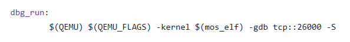

# BUAA OS 2025

本仓库包含了北京航空航天大学2025年操作系统课程的实验代码

## 实验建议
强烈建议将仓库克隆到本地，使用wsl + vscode进行实验开发。
使用现代ide能大大提高实验舒适感
善用AI

### 可能出现的问题
1. 本地vscode符号无法正确识别跳转
    1. 下载clangd插件（本地需要安装clangd）
    2. 生成对应的`compile_commands.json`文件
        ```bash
        sudo apt install bear
        bear -- make # 或者 make test=xxx
        ```

    3. 删除不必要的编译选项
        ```bash
        sed -i '/-march=4kc/d' compile_commands.json
        sed -i '/-mno-fix-r4000/d' compile_commands.json
        ```
    4. vscode `ctrl+shift+p` 打开命令面板，输入`clangd: Restart Language Server`重启语言服务器

2. vscode 如何debug
    1. 安装C/C++插件(禁用代码补全，启用clangd插件提供的)
    2. 在`.vscode`目录下创建[launch.json](./.vscode/launch.json)文件
        注意`"miDebuggerServerAddress"`字段的端口需要与Makefile中`dbg_run`下配置的端口相同。
        默认是1234端口，但是容易被占用，建议修改
        
    3. 命令行运行
        ```bash
        make dbg_run
        ```
        这会启动qemu并等待gdb连接
    4. 在vscode中按`F5`开始调试
    5. 在DEBUG CONSOLE中添加对应的符号文件，例如
        ```
        -exec add-symbol-file ./user/sh.b
        ```

## 分支介绍
exam 和 extra可以通过查看对应的test文件大致了解实验内容

除了lab0的extra不为正确的实现，其他实验的exam extra或对应的offline均为正确的实现（拿到所有分数）。

offline分支为实验的离线版本，我会将对应的题面放到该的分支下。

挑战性任务选择的是shell，也拿到了所有分数。