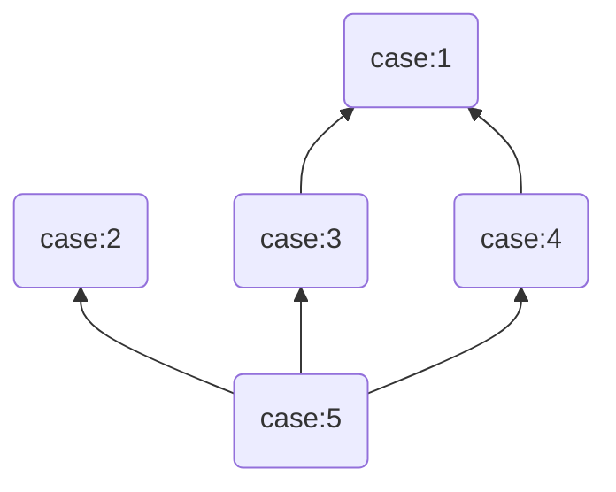

# Lab 5 Extra

## 准备工作：创建并切换到 `lab5-extra` 分支

请在**自动初始化分支后**，在开发机依次执行以下命令：

```console
$ cd ~/学号
$ git fetch
$ git checkout lab5-extra
```
初始化的 `lab5-extra` 分支基于课下完成的 `lab5` 分支，并且在 `tests` 目录下添加了 `lab5_encryptfs` 样例测试目录。

### 本题涉及文件系统诸多细节，若题面表述有不清楚之处，请及时询问助教。

## 题目背景

当前， MOS 的文件系统将数据以明文的形式保存在磁盘上，这埋下了数据泄漏的隐患，所有用户都可以直接读取任意文件，磁盘意外被他人获取后也可以直接读取数据。

为了消除这些隐患，**加密文件系统**的概念被提出。通过对文件或文件夹进行**加密**，可以防止未授权的访问。同时，加密文件系统提供了**透明性**，只需要正确配置密钥，合法用户可以使用既有方式，且对加密解密过程无感地读写文件。加密解密工作将由文件系统自动完成。

Windows 中的 NTFS 文件系统支持这样的功能。右键一个文件，在菜单中点击“属性”，在属性窗口中的“常规”选项卡中点击“高级”按钮，在高级属性窗口中可以看到“加密内容以便保护数据”​​。

我们可以在 MOS 现有的文件系统的基础上实现简单的加密文件系统。我们实现的加密文件系统**需要支持对于普通文件的加密，不需要考虑对于目录的加密**，同时需要提供一定的**透明性**。

## 加密算法

我们的加密文件系统的加密算法是**异或加密**。

异或运算 (*XOR*) 满足 `d ^ k = e` ， `e ^ k = (d ^ k) ^ k = d` 。所以异或加密的**加密和解密方法是相同的**。**对于原文，与密钥进行异或运算，即可得到密文；对于密文，与密钥进行异或运算，即可得到原文。**

当然，异或加密安全性较低，易被攻破。实际的加密文件系统采用 AES 算法或者更强大的非对称加密算法。

在 MOS 的文件系统中，文件内容被组织为一系列的磁盘块 (block)，每个磁盘块的大小为 4096 字节（由 `user/include/fs.h` 中的 `BLOCK_SIZE` 定义）。基于此，我们的加密文件系统的异或加密也是以磁盘块为单位进行的。**具体地，规定密钥长度为磁盘块的大小，即 4096 字节。加密时，对于文件内容的一个磁盘块的各个字节，将其与密钥的各个字节进行异或，即可得到密文。由上述异或运算性质，通过同样的方法可以由密文得到原文。**

上述过程用 C 语言代码可以如下表示：

```c
unsigned char *blk;
unsigned char encrypt_key[BLOCK_SIZE];

for (int i = 0; i < BLOCK_SIZE; i++) {
  blk[i] ^= encrypt_key[i];
}
```

密钥以**未加密的普通文件**在磁盘中存储。**合法的密钥文件**满足**文件内容至少有两个磁盘块**并且**第一个磁盘块的第一个字为 `FS_MAGIC`**（在 `user/include/fs.h` 中定义）。文件其余字节可为任意值。**规定密钥存储于合法的密钥文件的第二个磁盘块。**

## 系统行为

结合 MOS 现有的文件系统，为了使加密文件系统提供一定的透明性，使用加密文件系统操作文件的整体过程为：**加载密钥 > 打开文件 > 读写操作 > 关闭文件 > 卸载密钥**。

具体地，我们的加密文件系统的行为分为两部分，一是用户态程序与文件系统进行的交互，二是文件系统服务 `fs/serv` 的加密解密工作。

（一）用户态程序使用声明于 `user/include/lib.h` 的函数与文件系统进行交互。
1. **已经实现的文件系统功能不应受影响**。
2. 通过已有的 `open` 函数**以加密方式打开**一个文件，调用函数时需要额外给 `open` 函数的第二个**参数 `mode` 或运算 `O_ENCRYPT`**。如果当前未加载密钥，应返回 `-E_BAD_KEY` 。
   *由 MOS 的文件系统设计，使用 `open` 函数打开文件时会将文件的所有磁盘块读取到内存中，故可以利用文件系统服务 `fs/serv` 的文件解密功能实现该异常处理。*
3. 通过已有的 `close` 函数关闭一个**以加密方式打开**的文件。如果当前未加载密钥，应返回 `-E_BAD_KEY` 。
   *由 MOS 的文件系统设计，所有磁盘块直到使用 `close` 函数关闭文件时才会写入磁盘，故可以利用文件系统服务 `fs/serv` 的文件加密功能实现该异常处理。*
4. 通过已有的 `read` ， `write` ， `seek` 等函数进行读写和其他操作。**调用读取函数时，读出的内容应为解密后的原文。调用写入函数时，传入的是未加密的原文，但应将加密后的密文写入磁盘。**
5. 通过新增的 `int fskey_set(int fd)` 函数加载密钥。参数 `fd` 为使用 `open` 函数以**非加密且允许读**的方式打开密钥文件返回的文件描述符。如果文件描述符不合法，或以加密方式打开，或打开方式为只写，则返回 `-E_INVAL` 。函数通过 IPC 调用文件系统服务 `fs/serv` 的密钥加载功能并返回 IPC 的返回值。
6. 通过新增的 `int fskey_unset()` 函数卸载密钥。函数通过 IPC 调用文件系统服务 `fs/serv` 的密钥卸载功能并返回 IPC 的返回值。
7. 通过新增的 `int fskey_isset()` 函数判断当前是否加载密钥。函数通过 IPC 调用文件系统服务 `fs/serv` 的状态查询功能并返回 IPC 的返回值。

（二）加密解密工作由文件系统服务 `fs/serv` 完成。
1. **系统状态**：记录当前文件系统服务是否已经加载密钥，同时**缓存加载的密钥**。缓存密钥是为了实现只要加载了密钥，多个读写进程就可以利用文件系统服务使用相同的密钥以加密方式读写文件。同时，即使打开的密钥文件在完成密钥加载操作后被关闭，也不会影响到加密解密工作。
2. **密钥加载**：判断当前状态是否已加载密钥，如果已加载密钥， IPC 返回 `-E_BAD_KEY` ；如果未加载密钥，读取通过 IPC 传入的打开的文件，并判断该文件是否为合法密钥文件。如果不合法， IPC 返回 `-E_INVALID_KEY_FILE` ；如果未加载密钥且密钥文件合法，读取文件中的密钥并缓存，同时将当前状态标记为已加载密钥。
3. **密钥卸载**：判断当前状态是否已加载密钥，如果未加载密钥， IPC 返回 `-E_BAD_KEY` 。如果已加载密钥，则将当前状态标记为未加载密钥，并且清除密钥缓存。
4. **状态查询**：如果当前状态已加载密钥，**IPC 返回 `1`**，如果未加载密钥，**IPC 返回 `0`**。
5. **文件解密**：从磁盘读取以加密方式打开的文件的磁盘块时，判断当前状态是否已加载密钥，如果未加载密钥， IPC 返回 `-E_BAD_KEY` 。如果已加载密钥，在完成磁盘块读取后对其进行解密。
6. **文件加密**：写入以加密方式打开的文件的磁盘块到磁盘时，判断当前状态是否已加载密钥，如果未加载密钥， IPC 返回 `-E_BAD_KEY` 。如果已加载密钥，对原文进行加密后写入对应磁盘块。

（三）**说明**：
1. `O_ENCRYPT` 需在 `user/include/lib.h` 中定义。
2. `-E_INVALID_KEY_FILE` 和 `-E_BAD_KEY` 需在 `include/error.h` 中定义。
3. `fskey_set` 、 `fskey_unset` 和 `fskey_isset` 函数需在 `user/include/lib.h` 中声明并在 `user/lib/file.c` 中实现。
4. 若没有发生错误，应当 IPC 返回 0 。

## 参考实现

**只需要满足加密算法和系统行为的要求，各种实现方式都是可以接受的**。下面给出一种参考实现方式。

1. 在 `include/error.h` 中合适位置定义 `-E_INVALID_KEY_FILE` 和 `-E_BAD_KEY`。

```c
#define E_INVALID_KEY_FILE 14
#define E_BAD_KEY 15
```

2. 在 `user/include/fsreq.h` 中增加新的文件系统服务 IPC 请求号，并定义新的请求结构体。

```c
enum {
  ......
  FSREQ_KEY_SET,
  FSREQ_KEY_UNSET,
  FSREQ_KEY_ISSET,
  MAX_FSREQNO,
};

struct Fsreq_key_set {
  int req_fileid;
};
```

3. 在 `user/include/lib.h` 中合适位置声明新增的函数和 IPC 函数，并定义 `O_ENCRYPT` 。

```c
int fsipc_key_set(u_int fileid);
int fsipc_key_unset();
int fsipc_key_isset();

int fskey_set(int fd);
int fskey_unset();
int fskey_isset();

#define O_ENCRYPT 0x0010
```

4. 在 `fs/serv.c` 中定义相关变量用于标记当前状态和缓存密钥，实现相关的服务函数，并且添加到 `serve_table` 中。密钥文件的要求见“加密算法”一节。
   *提示：可以参考 `fs/fs.c` 的 `dir_lookup` 和 `read_super` 函数。*

```c
static int encrypt_key_set = 0;
static unsigned char encrypt_key[BLOCK_SIZE];

void serve_key_set(u_int envid, struct Fsreq_key_set *rq) {
  // 判断当前状态是否已加载密钥，如果已加载密钥， IPC 返回 -E_BAD_KEY

  // 利用 open_lookup 找到对应的 Open 结构体，判断文件大小是否至少有两个磁盘块大小
  // 利用 file_get_block 读取文件的第一个磁盘块，判断第一个字是否为 FS_MAGIC
  // 如果密钥文件不合法， IPC 返回 -E_INVALID_KEY_FILE

  // 利用 file_get_block 读取文件的第二个磁盘块，将密钥复制到 encrypt_key 中

  // 将当前状态标记为已加载密钥

  // IPC 返回 0

}

void serve_key_unset(u_int envid) {
  // 判断当前状态是否已加载密钥，如果未加载密钥， IPC 返回 -E_BAD_KEY

  // 将当前状态标记为未加载密钥

  // 将密钥缓存 encrypt_key 清零

  // IPC 返回 0

}

void serve_key_isset(u_int envid) {
  // IPC 返回当前状态

}

void *serve_table[MAX_FSREQNO] = {
  ......
  [FSREQ_KEY_SET] = serve_key_set,
  [FSREQ_KEY_UNSET] = serve_key_unset,
  [FSREQ_KEY_ISSET] = serve_key_isset,
};
```

5. 查看 `user/lib/file.c` 中的 `open` 函数，确保对 `fsipc_map` 函数的调用返回错误代码时，该错误代码将作为 `open` 函数的返回值。
   *提示：可以使用 `try()` 宏。*

6. 修改 `fs/serv.c` 中的 `serve_map` 函数。在读取文件磁盘块之前，判断该文件是否是以加密方式打开的，如果是，判断当前是否已加载密钥，如果未加载密钥， IPC 返回 `-E_BAD_KEY` ，**不将读取到磁盘块内存地址通过 IPC 共享**。对于以加密方式打开的文件，读取文件磁盘块之后，对读取到的磁盘块进行解密。解密算法见“加密算法”一节。

7. 修改 `fs/serv.c` 中的 `serve_close` 函数。在调用 `file_close` 将磁盘块写入之前，判断这个文件是否是以加密方式打开的，如果是，判断当前是否已加载密钥，如果未加载密钥， IPC 返回 `-E_BAD_KEY` ，**不进行后续的磁盘写入操作**。对于以加密方式打开的文件，对文件的**所有磁盘块进行加密后**再调用 `file_close` 进行磁盘写入。加密算法见“加密算法”一节。
   *提示：可以参考 `fs/fs.c` 的 `file_flush` 函数。*

8. 在 `user/lib/file.c` 中实现 `fskey_set` 、 `fskey_unset` 和 `fsipc_key_isset` 。在 `user/lib/fsipc.c` 中实现 `fsipc_key_set` 、`fsipc_key_unset` 和 `fsipc_key_isset` 函数，合理调用 `fsipc` 与文件系统服务 `fs/serv` 进行 IPC 。
   *提示：可以参考 `user/lib/file.c` 中的 `ftruncate` 函数。与文件系统服务进行 IPC 的编程方式可以参考 `user/lib/file.c` 和 `user/lib/fsipc.c` 中的其他函数。*

```c
/* user/lib/file.c */
int fskey_set(int fdnum) {
  // 使用 fd_lookup 找到对应的 Fd 结构体。判断传入的文件描述符是否合法
  // 如果不合法返回 fd_lookup 函数的返回值（该函数除了0之外，只会返回 -E_INVAL 错误码，符合系统行为要求）

  // 判断文件是否以加密方式打开，判断打开方式是否为只写
  // 密钥文件要求以非加密且允许读的方式打开，不满足则返回 -E_INVAL

  // 通过对 Fd 结构体进行处理获得 fileid ，合理调用相应文件系统 IPC 函数

}

int fskey_unset() {
  // 合理调用相应文件系统 IPC 函数

}

int fskey_isset() {
  // 合理调用相应文件系统 IPC 函数

}

/* user/lib/fsipc.c */
int fsipc_key_set(u_int fileid) {
  // 合理调用 fsipc 函数

}

int fsipc_key_unset(void) {
  // 合理调用 fsipc 函数

}

int fsipc_key_isset(void) {
  // 合理调用 fsipc 函数

}
```

## 本地测试

你可以使用：

- `make test lab=5_encryptfs && make run` 在本地测试样例（调试模式）
- `MOS_PROFILE=release make test lab=5_encryptfs && make run` 在本地测试样例（开启优化）

样例运行结果参考

```
......
[EXAMPLE] open key0.key is good
[EXAMPLE] fskey_set() is good
[EXAMPLE] close key0.key is good
[EXAMPLE] fskey_isset() is good
Let the ruling classes tremble at a Communistic revolution.
The proletarians have nothing to lose but their chains.
They have a world to win.
[EXAMPLE] read is good
 W  o  r  k  e  r  s     o  f     t  h  e     w  o  r  l  d  ,     u  n  i  t  e  !
ee 83 4c d0 60 a4 6e 00 c2 c8 64 6a 0e 9a 28 22 92 62 61 29 8f 2e a3 19 49 bf 82 91 74 bf 60 cc
[EXAMPLE] write is good
[EXAMPLE] fskey_unset() is good
......
```

或者在 `init/init.c` 的 `mips_init` 函数中以及 `user/fstest.c` 等文件中自行编写测试代码，使用 `make && make run` 测试。

此外，在跳板机上可以使用 `xxd <file>` 命令查看一个文件的十六进制表示。

## 提交评测 & 评测标准

请在开发机中执行下列命令后，**在课程网站上提交评测**。

```console
$ cd ~/学号
$ git add -A
$ git commit -m "message"  # 请将 message 改为有意义的信息
$ git push
```

具体要求和分数分布如下：

| 测试点序号 | 评测内容                                           | 分数 |
| ---------- | -------------------------------------------------- | ---- |
| 1          | 单读写进程，仅使用一个密钥                         | 15   |
| 2          | 单读写进程，测试所有异常处理                       | 20   |
| 3          | 单读写进程，依次使用多个密钥                       | 20   |
| 4          | 多读写进程，共享使用一个密钥                       | 20   |
| 5          | 多读写进程，依次共享使用多个密钥，测试部分异常处理 | 25   |

测试点依赖关系如下（箭头方向表示依赖方向）：



**提示**：

1. 1号测试点与下发样例执行相同的工作，代码差异仅为替换了密钥文件和写入内容。
2. 5号测试点综合使用了 Lab1 至 Lab5 的内容，包括 Lab1 的输出函数和字符串处理函数、 Lab4 的 fork 调用等。同时对 Lab3 的进程管理和 Lab4 的 IPC 实现的正确性有较高要求。

**说明**：

1. **所有测试点的密钥均与下发样例的密钥不同。硬编码下发的密钥无法通过评测**。
2. MOS 的文件系统可能存在一定的缺陷，**保证各评测点均不考察下发代码中非填写部分的已有设计或者潜在缺陷**。特别说明以下三种情况：
   - 现有部分函数的实现方式可能导致文件描述符无法被回收。评测保证在文件描述符相关功能实现正确的前提下，打开的文件数量不会耗尽可用的文件描述符。
   - 现有 `close` 函数的行为是无论关闭过程是否发生了错误，都会将传入的文件描述符释放。评测保证如果调用 `close` 函数关闭文件时发生了错误（如未加载密钥），不会对已被释放的文件描述符再次调用 `close` 等文件操作函数。
   - 现有的磁盘块映射到内存机制是在已有映射的情况下不会再次从磁盘读取该磁盘块，然而文件系统服务的全周期并不会解除映射。这会导致未写入磁盘的数据据滞留内存且不会再读取磁盘中对应磁盘块的原始数据。评测保证调用 `close` 函数关闭文件时发生了错误（如未加载密钥），不会以加密或非加密方式重新打开该文件进行读写。
3. 在线评测时，所有的 `.mk` 文件、所有的 `Makefile` 文件、`init/init.c` 以及 `tests/` 和 `tools/` 目录下的所有文件都可能被替换为标准版本，因此请同学们本地开发时，**不要**在这些文件中编写实际功能所依赖的代码。

------

可能今天是很多同学最后一次参与 OS 限时测试了。无论是否完成了今天所有的题目， OS 实验课程的学习是顺利还是遗憾，都恭喜你，祝福你！希望之后 OS 和其他课程的学习顺利！

如果你也希望传递 OS 实验课程的学习经验与心得，有热情参与 OS 实验课程的建设中。欢迎加入 OS 实验课程助教团队，敬请留意后续通知。 Let's be the S.T.A.R. of OS!
